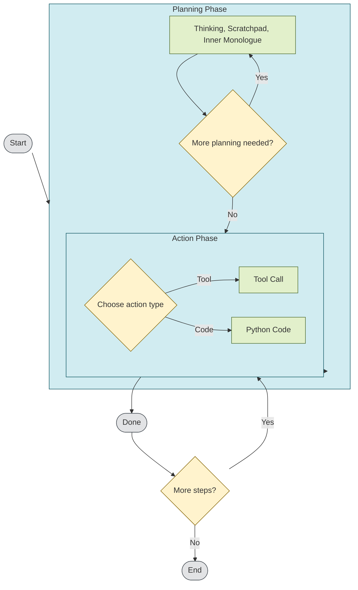

# Proxy Base Agent (Research Preview)

The **Proxy Base Agent (PBA)** is a foundational agent framework built upon the [Proxy Structuring Engine (PSE)](https://github.com/TheProxyCompany/proxy-structuring-engine). It provides a structured state machine architecture designed to rapidly prototype and develop LLM-powered agents, emphasizing local execution, stateful interactions, and extensibility.

### Official documentation is available at [docs.theproxycompany.com/pba](https://docs.theproxycompany.com/pba/).

## Overview

An **agent** is a system that takes actions in an environment. The Proxy Base Agent leverages the PSE to augment language models at runtime, enabling goal-oriented interactions, multi-step reasoning, and external tool usage.

## Architecture

The agent operates through a structured workflow defined by a **state graph**, transitioning between clearly defined **planning** and **action** phases:



This state graph can be easily modified and extended, allowing for a wide range of agentic behaviors.

### Planning Phase

The agent engages in iterative reasoning through multiple cognitive states:

- **Thinking**: High-level reasoning and goal setting.
- **Scratchpad**: Intermediate notes and working memory.
- **Inner Monologue**: Reflective reasoning and self-assessment.

### Action Phase

After sufficient planning, the agent transitions to executing actions:

- **Tool Calls**: Interaction with external APIs or custom tools.
- **Python Code Execution**: Direct execution of Python scripts for complex tasks.

## Installation & Quickstart

Prerequisites:

- Python 3.10 or higher
- Linux, macOS, or Windows
- Hardware requirements vary depending on the underlying language model.

Quick installation:

```bash
# Clone the repository
git clone https://github.com/TheProxyCompany/agent.git
cd agent

# Install dependencies
pip install proxy-base-agent

# Launch interactive setup wizard
python -m agent
```

## Language Models & Inference

The agent supports local inference via Huggingface Transformers, with tested support for MLX & PyTorch. Planned support includes VLLM, SGLang, TensorFlow, and Jax.

Any model supported by Huggingface Transformers can be used, with instruct-tuned models recommended for optimal performance.

## Related Projects

- [Proxy Structuring Engine (PSE)](https://github.com/TheProxyCompany/proxy-structuring-engine): Core engine providing grammatical constraints and structured output generation.
- [MLX Proxy](https://github.com/TheProxyCompany/mlx-proxy): Optimized inference frontend for MLX models.

## Research Preview & Licensing

The Proxy Base Agent is currently shared as a research preview. It is maintained as a research project and is not intended for direct production use.

Commercial licenses are available for those interested in using the agent commercially. Contributions to the project are encouraged, and meaningful contributors are eligible for free commercial licenses.
