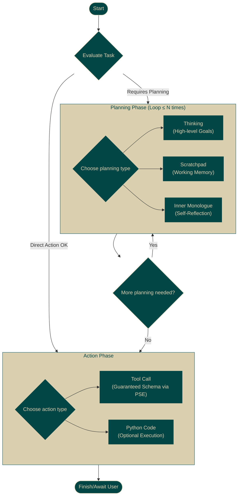

<p align="center">
  
</p>

<h1 align="center">Proxy Base Agent (PBA)</h1>

<h2 align="center">
  A truly stateful agent with 100% reliable tool use.
</h2>

<p align="center" style="font-size: 1.2em; width: 80%; max-width: 700px; margin: 0 auto; padding-bottom: 20px;">
  Build custom agents on any LLM with guaranteed state consistency and controllable execution, powered by the <a href="https://github.com/TheProxyCompany/proxy-structuring-engine">Proxy Structuring Engine (PSE)</a>.
</p>

<p align="center">
  <a href="https://github.com/TheProxyCompany/proxy-base-agent/blob/main/LICENSE"></a>
  <a href="https://docs.theproxycompany.com/pba/"></a>
</p>

---

## The Agent Problem: Unreliable Execution.

Standard LLM agents are fundamentally flawed for real-world tasks. They operate on fragile prompt chains, leading to unpredictable state management, hallucinated parameters, and failed tool calls. Debugging is a nightmare; reliable automation is often impossible.

**The Proxy Base Agent (PBA) is the engineered solution.** It leverages the **[Proxy Structuring Engine (PSE)](https://github.com/TheProxyCompany/proxy-structuring-engine)** – our high-performance Hierarchical State Machine (HSM) engine – to transform LLMs into **truly stateful, reliable execution engines.**

Forget hoping for the best. With PBA, you **program** agent behavior through a defined state graph, and PSE **guarantees** the LLM adheres to it, step-by-step.

## PBA: Engineered Reliability & Dynamic Control

PBA delivers capabilities beyond the reach of conventional agent frameworks:

*   🧠 **True Stateful Execution:** Define and enforce complex workflows using an explicit HSM (Plan ➔ Act). PSE guarantees state consistency and prevents derailment. *(Achieves the headline promise)*
*   ✅ **100% Reliable Tool Use:** Eliminate runtime errors from malformed API calls or hallucinated arguments. PSE validates tool inputs against their schemas *during generation*. *(Achieves the headline promise)*
*   ⚡ **Dynamic Runtime Adaptation (MCP):** Integrate new tools and capabilities on-the-fly via the Model Context Protocol. PBA dynamically updates its internal HSM, allowing immediate, reliable use of new functions without restarts. *(Killer Feature)*
*   ⚙️ **Predictable Control Flow:** Move beyond prompt ambiguity. Explicitly define agent reasoning patterns and action sequences for deterministic, controllable behavior.
*   🔌 **Universal LLM Compatibility:** Run sophisticated agents locally on the models you choose (open-source or custom), using your preferred backend (MLX, PyTorch supported, more coming).
*   🧩 **Modular & Extensible:** Build bespoke agents by adding custom tools, defining new states, or modifying the core HSM architecture to fit your precise needs.

## How It Works: HSM-Governed Execution

PBA's reliability stems from PSE's runtime governance. The agent's core logic is an HSM defining its operational cycle:



1.  **HSM Definition:** The agent's states (Thinking, Tool Call, etc.) and transitions are defined as a `StateMachine`. Each state itself uses a nested PSE `StateMachine` to govern its internal structure (e.g., fenced text for planning, JSON schema for tool calls).
2.  **PSE Enforcement:** During generation, PSE's `StructuringEngine` ensures:
    *   The LLM follows valid transitions within the agent's HSM.
    *   The content generated *within* each state conforms to that state's specific structure (e.g., valid JSON for `ToolCallState`).
    *   Tool call arguments precisely match the required schema.
3.  **Dynamic Updates (MCP):** When new tools are added via `add_mcp_server`, PBA rebuilds the `ToolCallState` HSM and reconfigures PSE **at runtime**. This allows the agent to instantly leverage new capabilities with the same structural guarantees.

**PBA doesn't just *ask* the LLM to be stateful and reliable; it *engineers* it through PSE's runtime HSM governance.**

## Installation

```bash
pip install proxy-base-agent
```
*(See [Installation Docs](https://docs.theproxycompany.com/pba/getting-started/installation/) for full details, development setup, and framework extras)*

## Quickstart

Launch the interactive setup wizard:

```bash
python -m agent
```

Configure your LLM and backend, then start interacting with a stateful, reliable agent running locally.

*(See the [Quickstart Docs](https://docs.theproxycompany.com/pba/getting-started/quickstart/) for a detailed walkthrough)*

## Unlock Full Potential: Commercial Services & Support

PBA provides an unparalleled open-source foundation. Harnessing its full power for complex, mission-critical, or highly customized agentic systems requires deep expertise in HSM design, dynamic agent architecture, and production optimization.

**The Proxy Company offers expert services to ensure your success:**

*   **Bespoke Agent Engineering:** Custom-built agents precisely tailored to your complex workflows and operational requirements.
*   **Advanced Integration Services:** Seamlessly and reliably connect PBA to proprietary APIs, enterprise systems, and specialized tools via custom `Tool` or `MCPServer` development.
*   **Production Deployment & Scale:** Architecture consulting, performance tuning, and robust support contracts for mission-critical deployments.
*   **Strategic HSM & Agent Design:** Leverage our foundational expertise to architect optimal solutions for your most challenging AI automation goals.

**Build AI systems you can confidently delegate to.**

➡️ **[Explore Services & Schedule Consultation](https://theproxycompany.com/business)**

## License

The `proxy-base-agent` Python library is licensed under Apache 2.0 ([LICENSE](LICENSE)).
It depends on `pse` (Apache 2.0) and the proprietary `pse-core` (License details in [PSE README](https://github.com/TheProxyCompany/proxy-structuring-engine#license)).

## Citation

```bibtex
@software{Wind_Proxy_Base_Agent_2025,
  author       = {Wind, Jack},
  title        = {{Proxy Base Agent: Reliable and Adaptive Agents via Hierarchical State Machines}},
  version      = {1.0.0}, # Adjust version as needed
  date         = {2025-03-31}, # Adjust date as needed
  url          = {https://github.com/TheProxyCompany/proxy-base-agent},
  publisher    = {The Proxy Company},
  note         = {Built upon the Proxy Structuring Engine}
}
```
